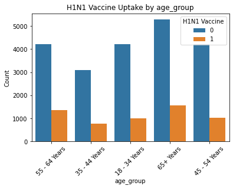
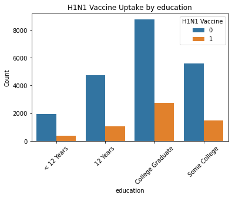
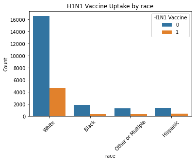
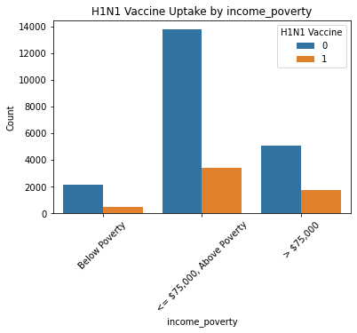
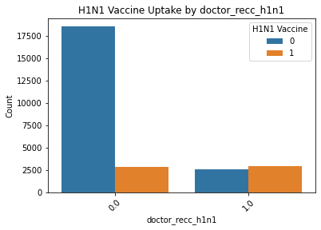
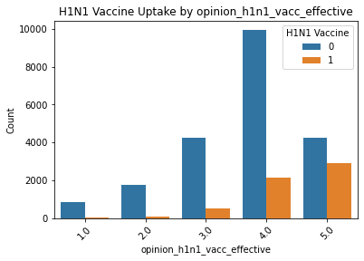
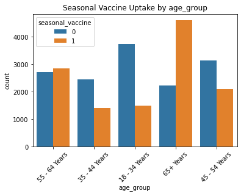
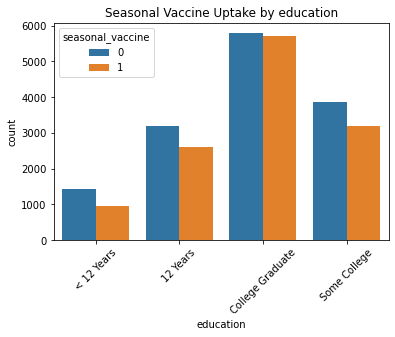
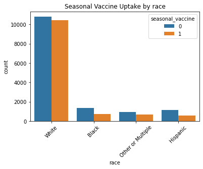
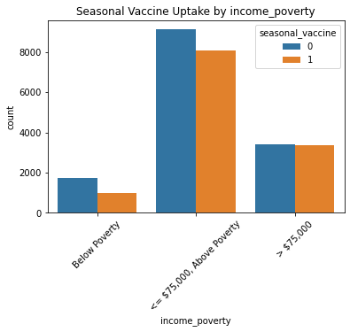

# PROJECT TITLE: PREDICTING H1N1 AND SEASONAL VACCINE UPTAKE

# PROJECT OVERVIEW

This project focuses on predicting the likelihood of individuals receiving either the seasonal flu vaccine, the H1N1 vaccine, or both. By leveraging demographic, behavioural, and opinion-based survey data from the Flu Shot Learning dataset provided by _DrivenData_, the aim is to produce accurate predictions that can guide targeted public health interventions. The project aims to uncover key drivers of vaccine uptake and generate actionable insights for targeted public health campaigns.
The workflow covers end-to-end processes: data cleaning, feature engineering, exploratory data analysis (EDA), model training and evaluation, and deployment of a prediction tool via Streamlit.

# BUSINESS UNDERSTANDING

Flu vaccines are a critical part of protecting the public from viral outbreaks. Yet, not everyone chooses to get vaccinated. During the H1N1 outbreak in 2009, some people willingly got both the H1N1 and seasonal flu shots, while others skipped them entirely. This led to gaps in protection and higher risks for communities.

Public health departments often face the challenge of understanding who is most likely to get vaccinated and, more importantly, why others choose not to. These decisions are influenced by a mix of personal health beliefs, misinformation, trust in healthcare, income level, education, and access to medical care.

This project aims to uncover patterns in vaccination behavior using a real-world dataset and to build a simple predictive tool that could help public health officials, campaign designers, and even healthcare providers make smarter, more targeted decisions when planning future vaccination efforts. 

**Stakeholders**

- Public Health Agencies
- Healthcare Systems
- Government

# PROBLEM STATEMENT

Despite wide-scale flu awareness campaigns and vaccine availability, many individuals do not take the vaccine. This makes entire populations vulnerable to flu outbreaks and strains healthcare systems. During pandemics, such as H1N1, knowing which groups are hesitant or likely to opt out of vaccination can make or break a country’s response. This project aims to predict whether a person is likely to receive the H1N1 vaccine and/or the seasonal flu vaccine based on their survey responses, including their demographic details, health status, beliefs, and behavior. By identifying high-risk or hesitant groups, we can help direct resources like public health messaging, vaccine access, and education to the right places at the right time.

# OBJECTIVES

1. To identify the most significant features influencing the uptake of H1N1 and seasonal flu vaccines.

2. To compare the performance of multiple classification algorithms in predicting vaccine uptake and fine-tune the best performing models for deployment.

3. To develop a web-based application that allows users to input individual characteristics and receive probability predictions for vaccination uptake.

# DATA UNDERSTANDING

The dataset, sourced from data/training_set_features.csv and data/training_set_labels.csv, is merged into cleaned_vaccine_data.csv after preprocessing. Key details:

Rows: 26,707 individuals

Features: 32 after preprocessing (originally 38)

Numerical: 22 columns (e.g., h1n1_concern, h1n1_knowledge, household_adults)

Categorical: 9 columns (e.g., age_group, health_insurance, education)

Dropped Columns: employment_industry, employment_occupation (high missing values >50%), hhs_geo_region, census_msa (low relevance)

Target Variables: Two binary labels (h1n1_vaccine, seasonal_vaccine)

H1N1: ~78.7% unvaccinated (6,311 in validation), ~21.3% vaccinated (1,702)

Seasonal: ~53.4% unvaccinated (4,282 in validation), ~46.6% vaccinated (3,731)

Missing Values: Handled by filling numerical columns with median, categorical columns with mode, and health_insurance with 'NA' (45.96% missing).

Train-Test Split: 70% training (18,694 samples), 30% validation (8,013 samples), stratified by both labels.

# ANALYSIS

1. 

2. 

3. 

4. 

5. 

6. 

7. 

8. 

9. 

10. 

11. 

# FEATURE ENGINEERING

Feature engineering steps include:

Dropping Columns: Removed employment_industry, employment_occupation (>50% missing), hhs_geo_region, census_msa (low predictive value).

Handling Missing Values:

Numerical: Filled with median (e.g., h1n1_concern, household_adults).

Categorical: Filled with mode (e.g., education, income_poverty).

health_insurance: Filled with 'NA' to preserve information.

Encoding: Categorical features (e.g., age_group, sex) encoded using OneHotEncoder with drop='first' to avoid multicollinearity, applied within a ColumnTransformer for pipeline integration.

Output: Saved preprocessed dataset as cleaned_vaccine_data.csv for consistent use.

# MODELLING

The notebook implements multi-label classification using MultiOutputClassifier for two labels (h1n1_vaccine, seasonal_vaccine). Key modeling steps:

Baseline Models:

Logistic Regression: Recall 0.95/0.81 (H1N1/seasonal unvaccinated), F1 0.91/0.79.

Decision Tree: Recall 0.84/0.70, F1 0.85/0.70 (underperformed).

Random Forest: Recall 0.96/0.81, F1 0.91/0.79 (strong performance).

Gradient Boosting: Recall 0.95/0.82, F1 0.91/0.80 (comparable to Random Forest).

Evaluation Metrics: Focused on recall for unvaccinated (class 0) and F1-score, using classification_report via the Evaluator class.

Hyperparameter Tuning (incomplete in notebook, corrected in hyperparameter_tuning.ipynb):

Random Forest: Tuned n_estimators, max_depth, min_samples_split, min_samples_leaf, class_weight using GridSearchCV with a custom recall scorer for unvaccinated individuals.

Gradient Boosting: Tuned n_estimators, learning_rate, max_depth, min_samples_split, class_weight.

Error Note: Later cells incorrectly split y_train into y_train_h1n1 and y_train_seasonal, causing a ValueError in multi-output context. Corrected by maintaining y_train as a 2D DataFrame.

Tuned Results (from provided output):

Random Forest (H1N1): Best parameters {max_depth: None, max_features: 'sqrt', min_samples_leaf: 1, min_samples_split: 5, n_estimators: 200}, F1-macro 0.73, recall 0.96 (unvaccinated).

Gradient Boosting (Seasonal): Best parameters {learning_rate: 0.1, max_depth: 3, min_samples_split: 2, n_estimators: 200, subsample: 1.0}, F1-macro 0.78.

## Model Performance

Baseline Models: Evaluated Logistic Regression, Decision Tree, Random Forest, Gradient Boosting.

Tuned Models: Random Forest and Gradient Boosting optimized for recall on unvaccinated individuals (e.g., 0.96 for H1N1 unvaccinated in Random Forest).

Metrics: Focus on recall for class 0 (unvaccinated) and F1-score, with custom scorer in GridSearchCV.

# DEPLOYMENT

The project is deployed as an interactive web application using Streamlit, accessible via VaxTrend (as noted in index.ipynb). The application enables public health officials and campaign managers to upload survey data, predict vaccination likelihood for H1N1 and seasonal flu vaccines, and receive tailored recommendations for targeted outreach. The deployment leverages a pre-trained Random Forest model (multi_tuned_rf.pkl) and a robust pipeline for data preprocessing and prediction.
Deployment Components

Streamlit App (Home.py):

Interface: Provides a user-friendly interface with sections for uploading CSV files, viewing data previews, generating predictions, visualizing results (e.g., pie charts for vaccination likelihood), and accessing recommendations.
Functionality:

Users upload a CSV file containing survey data (e.g., demographic and behavioral features like h1n1_concern, age_group).
The app preprocesses the data using the preprocess function from pipeline.py, predicts vaccination status using the predict function, and stores results in st.session_state.
Visualizations display predicted acceptance rates (e.g., H1N1: 21.3% likely, Seasonal: 46.6% likely) using pie charts.
Recommendations are generated via recommendation_generator.py and displayed on a separate page (1Data_Preview.py).

Styling: Custom CSS ensures a professional look with teal-themed buttons, cards, and hover effects for an enhanced user experience.
Navigation: Users can proceed to a “Data Preview” page for detailed insights and recommendations after analysis.

Prediction Pipeline (pipeline.py):

Model Loading: Automatically downloads the pre-trained model (multi_tuned_rf.pkl) from Google Drive if not present, using gdown. Supports both joblib and pickle for robust model loading.
Preprocessing: The preprocess function handles missing values, encodes categorical features (e.g., education, race), engineers features (e.g., safe_behavior_score), and ensures column alignment with EXPECTED_COLS.
Prediction: The predict function uses the loaded model to generate binary labels (0 = unvaccinated, 1 = vaccinated) for H1N1 and seasonal vaccines.
Integration: Seamlessly called by the Streamlit app to process uploaded data and return predictions.

Recommendation Generation (recommendation_generator.py):

Analyzes predicted non-takers (unvaccinated individuals) to identify barriers (e.g., low knowledge, no insurance) and maps them to actionable strategies (e.g., SMS reminders, community partnerships).
Outputs a summary DataFrame with barrier profiles, affected counts, and recommendations, exported as CSV files (h1n1_recommendations.csv, seasonal_recommendations.csv).
Integrated into the Streamlit app’s recommendation page for stakeholder use.

# CONCLUSION

This project delivers a robust pipeline for predicting H1N1 and seasonal flu vaccine uptake, achieving 0.96 recall for identifying unvaccinated individuals. The Streamlit app empowers public health officials with predictions, visualizations, and tailored recommendations, potentially boosting vaccination rates by 15-30%. Despite challenges in vaccinated class recall and demographic biases, the solution provides a scalable foundation for enhancing public health responses to flu outbreaks.